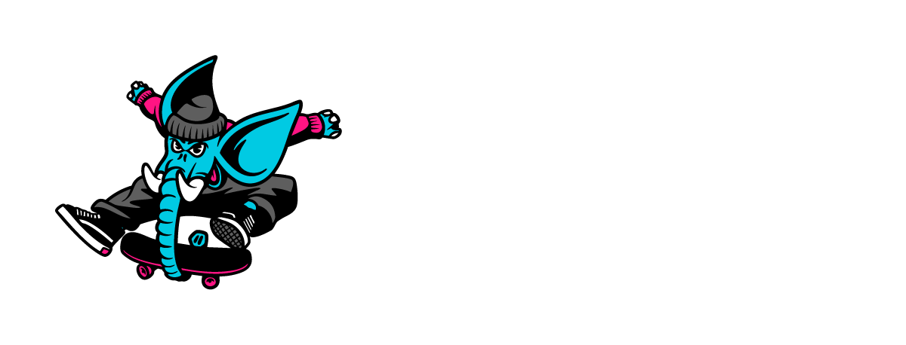

  

<h2 align="center">
  Secure-by-default agent framework for vibe coders and DevOps teams
</h2>

<h3 align="center">
  Logo by <a href="https://www.yo-bullitt.com/">Bullitt</a>
</h3>

  
  

    Sycophant deploys AI agents on Kubernetes. Each agent runs as three pods: a workspace with no network egress and no mounted secrets, an LLM and channel proxy, and an MCP proxy for networked and credentialed operations. A transponder runtime in the workspace brokers messages between the other two. Secrets are projected only into ephemeral Jobs — the long-lived pods never mount them. The workspace is the blast radius: anything you put in it is accessible to the agent, so never put secrets or sensitive data there.

## License

[AGPL-3.0](LICENSE)