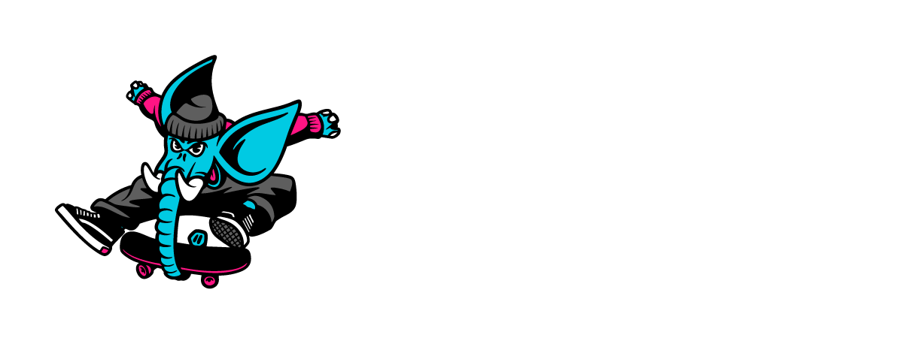
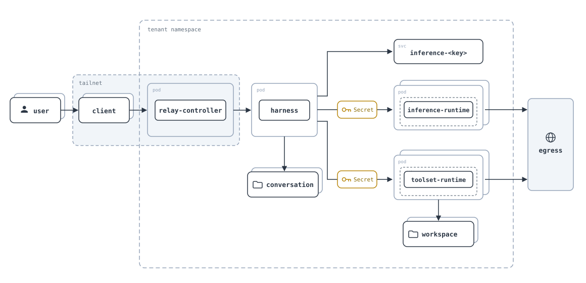

<p align="center">
  
</p>

<h2 align="center">
  The zero-trust framework for autonomous AI agents.
</h2>

<p align="center">
  <a href="https://scorecard.dev/viewer/?uri=github.com/calebfaruki/sycophant"></a>
  <a href="https://deepwiki.com/calebfaruki/sycophant"></a>
  <a href="https://www.rust-lang.org/"></a>
  
  <a href="LICENSE"></a>
</p>

Sycophant runs autonomous AI agents inside a Kubernetes cluster built on least privilege, zero knowledge, and defense in depth. Everything the agent produces is treated as adversarial.

> **Pre-release and under active development.** The architecture below is the design the project is built around. Expect sharp edges.

## Why Sycophant

Most agent frameworks are built for capability, not containment. Isolation is something you bolt on, if you remember to.

Hosted platforms take the other extreme. The model, your data, and the agent all run on their infrastructure. You get controls, but they are settings on machines you do not own, backed by promises you have to trust.

Sycophant is neither. Your data lives on infrastructure you choose. The agent answers only to devices you approve. Containment is the default, not an add-on.

## What a compromised agent can't do

Assume the agent is fully subverted: prompt injection, a poisoned tool, a bad model. It still cannot:

- **Read a secret.** Model keys and tool credentials exist only inside short-lived jobs, for the seconds a call needs them.
- **Call the network freely.** The agent has no direct egress. Every outbound route is a broker with an explicit allowlist.
- **Break out of a tool.** Each tool runs in its own throwaway sandbox with only the credentials and network access it declared.
- **Rewrite its own history.** The conversation log is owned by a separate component the agent can't write to.
- **Reach another tenant.** Every tenant has its own network, storage, and identity, with no route from one tenant into another.

## How the guarantees hold

The security is not configured. It is enforced. Admission control rejects any pod that breaks the rules, network policy blocks any traffic that isn't explicitly allowed, and the agent has no RBAC to abuse. There are no knobs to tune, so there are none to get wrong.

Isolation comes from Kubernetes itself. Each tenant is a namespace. Each component is a pod. Every model or tool call runs in a short-lived throwaway pod. The agent's files live on one workspace volume that its tool pods share. That volume is the agent's own space. Secrets, tokens, and network access are not shared, and none outlive the pod that used them.

- **Brokered credentials.** The agent asks a broker by name. The broker gives each call its own throwaway pod, and only that pod ever holds the secret. Neither the agent nor the broker sees it.
- **Scrubbed output.** A tool sometimes needs credentials to run. Before its output returns to the agent, every appearance of those credential values is replaced with a redaction marker. The same scrub runs on model output. The agent gets results, never keys.
- **A worthless identity.** The agent's pod has no RBAC and mounts no token by default. And each token it does use only works with one service. No privilege escalation.
- **Separation, not permission.** The conversation log lives on a volume the agent's pod never mounts. The agent cannot rewrite history because it cannot touch the file.
- **Closed by default.** Cilium gives every pod a default-deny egress firewall. Each pod reaches only the destinations it names. gVisor sandboxes the chambers that run agent-written code, so a container escape stops at the sandbox and never reaches the host.
- **Enforcement out of reach.** Kyverno creates each tenant's RBAC when its namespace appears, and blocks edits to the security resources from inside that namespace. The admission policies sit where the agent's identity cannot reach them. The agent cannot change the rules that bind it.

None of this is taken on trust. The Chainsaw suite runs against a live cluster. Each test tries a forbidden action and checks that the cluster refuses. A second check deletes a policy and reruns the tests to confirm they fail without it.

## Quickstart

Sycophant ships as Helm charts. There are two ways in.

**CLI — local, secure by default.** The `syco` CLI stands up a local [k3d](https://k3d.io) cluster with the full capability stack ([see Requirements](#requirements)) already wired in:

```sh
syco setup
```

**DevOps — your own cluster.** Install the charts with Helm. The `sycophant-quickstart` chart bundles the gVisor RuntimeClass and Kyverno CRDs, so one command gives you a working cluster:

```sh
kubectl apply -f charts/sycophant-cluster/system-ns.yaml

helm install sycophant charts/sycophant-quickstart \
  -n sycophant-system --set policyEngine=kyverno --wait
```

Already provide your own RuntimeClass and CRDs ([see Requirements](#requirements))? Skip the bundle and install the cluster layer alone:

```sh
helm install sycophant charts/sycophant-cluster \
  -n sycophant-system --set policyEngine=kyverno --wait
```

## Components

Five components, each with a single, well-defined job. The agent asks a broker by name. The broker holds the credentials and network access needed to answer. Neither secrets nor egress reach the agent.

<p align="center">
  
</p>

| Component | Role |
| --- | --- |
| **Transponder** | The harness — the agent runtime, one per workspace. Runs the agent loop and owns the conversation history. |
| **Tightbeam** | The client gateway. Registered devices dial in through it to reach their agent, and it relays messages to and from the transponder. |
| **Hangar** | The model broker. Calls model-provider APIs on the agent's behalf. |
| **Airlock** | The tool broker. Runs each tool in an isolated, throwaway sandbox. |
| **Mainframe** | The prompt broker. Injects each workspace's instructions, sub-agents, and skills into the agent runtime. |

Built as a Rust monorepo on gRPC (tonic/prost), Kubernetes CRDs (kube-rs), and Helm charts. The `syco` CLI drives it. Images target Linux arm64 and amd64.

## Requirements

Sycophant runs on any conformant Kubernetes cluster. It relies on three cluster capabilities. Each is a swappable role with a sensible default:

- **Sandboxed container runtime:** a `gvisor` RuntimeClass by default (Kata is a supported alternative). Isolates the chambers that run agent-executed tool code.
- **Network egress control:** Cilium (default-deny egress with an L7 DNS allowlist).
- **Admission policy engine:** Kyverno 3.5.x, with its CRDs.

`syco setup` installs this default set on a local k3d cluster for you. Running it needs a local toolchain: k3d, helm, kubectl, cargo (rustup), protoc, cmake, and a C compiler.

## Local development

The local target is a k3d cluster. To exercise the full stack end to end:

```sh
OPENROUTER_API_KEY=... scripts/e2e.sh
```

This spins up a clean k3d cluster, builds and loads all images, deploys the Helm charts, and runs the security assertions. Charts live under [`charts/`](charts/) (`sycophant-quickstart` is the install bundle). Per-component design docs live under [`docs/`](docs/): [airlock](docs/airlock.md), [hangar](docs/hangar.md), [mainframe](docs/mainframe.md), [tightbeam](docs/tightbeam.md), and [secrets providers](docs/secrets-providers.md).

## Security

Security is structure, not configuration. Simplicity, not complexity. See [SECURITY.md](SECURITY.md) for reporting and [THREAT_MODEL.md](THREAT_MODEL.md) for the full model.

## Contributing

Contributions are welcome. Open an issue to discuss a change, or send a pull request. Start with the design docs under [`docs/`](docs/) to get oriented.

## License

[AGPL-3.0](LICENSE)

Logo by [Bullitt](https://www.yo-bullitt.com/).
